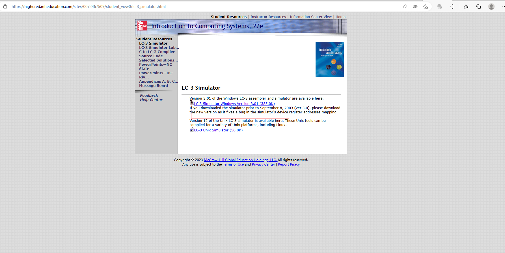
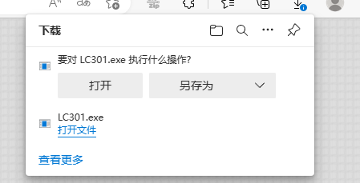
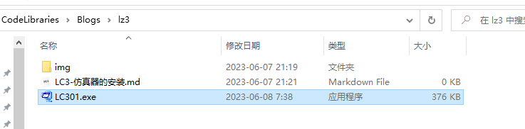
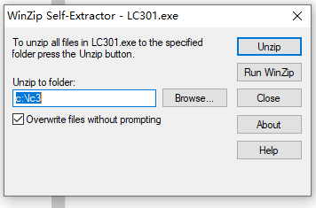
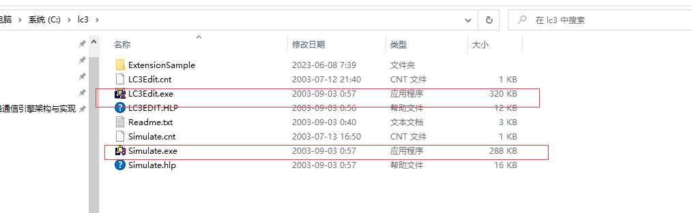
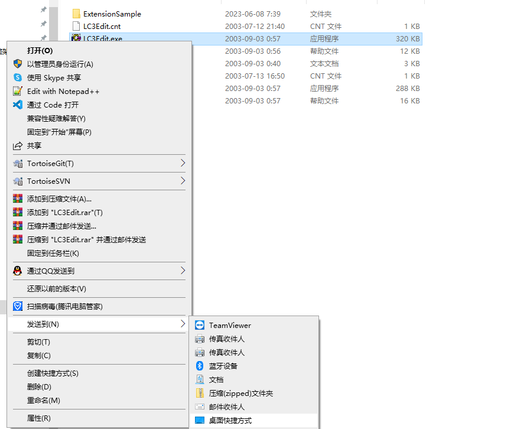
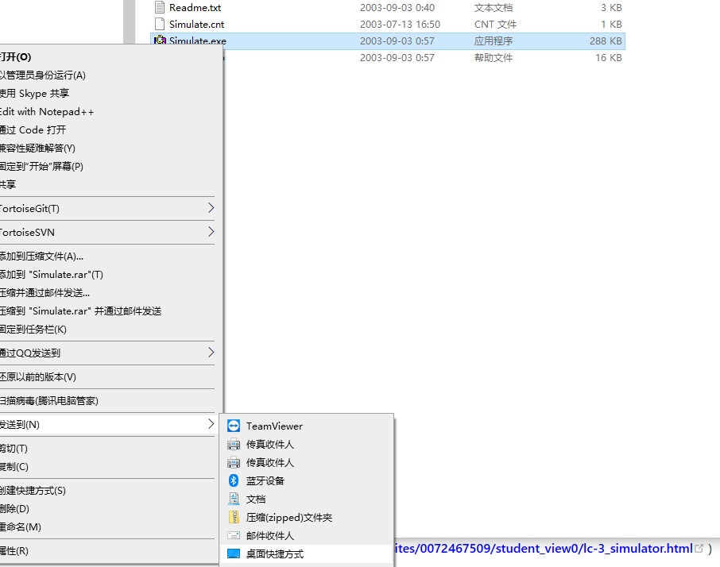
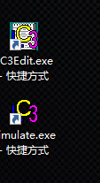

# LC3-仿真器安装

>参考：[Download and Install LC-3 | CS 131 - Computer Organization (comp-org-etext.netlify.app)](https://comp-org-etext.netlify.app/assembly/gettingstarted/downloadandinstall.html#introduction)
>
>如觉得本文写的不够详细，可参考如上网址。

## 介绍

小型计算机LC-3 汇编环境是一种模拟指令架构（ISA），用户学习汇编语言编程的基础知识，ISA仅限于20+条实际指令。但是包含足够多的功能来学习和实验汇编。

LC-3是一种模拟冯诺依曼计算机指令集架构（ISA）。它的目的主要用于教授汇编编程和强调控制微架构。

LC-3编辑器和模拟器在课程中使用定义的ISA创建程序，这些程序以最低级别的人类可读语言“汇编”实现标准输入-处理-输出流程。

## 下载工具

下载链接：

https://highered.mheducation.com/sites/0072467509/student_view0/lc-3_simulator.html

## 安装

双击下载到的LC301.exe

点击Unzip

查看c:\lc3目录下是否有以下文件，有的话就是安装成功。

右键发送到桌面快捷方式

桌面图标标识

## LC3 指令集架构（ISA）参考手册

LC-3手册：https://comp-org-etext.netlify.app/downloads/LC3/lc3-isa.pdf

